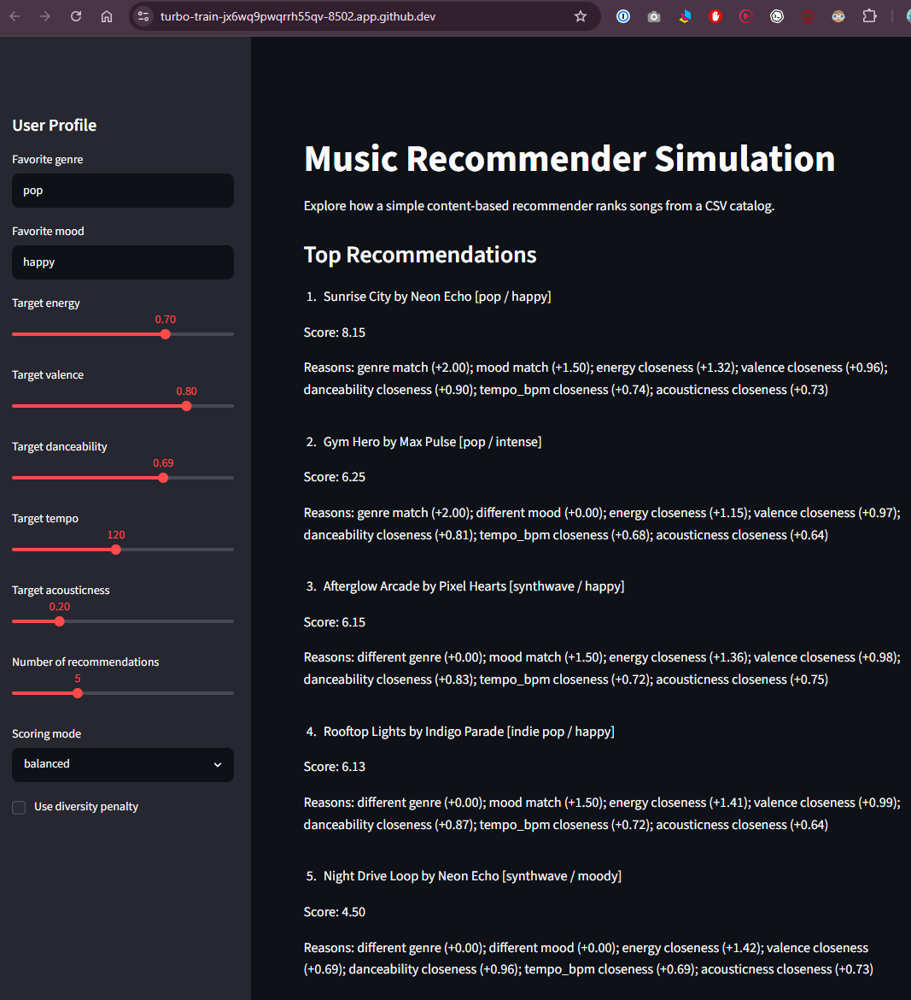

# 🎵 Music Recommender Simulation

## Project Summary
In this project I built and explained a small music recommender system. The goal is to represent songs and a user taste profile as data, design a scoring rule that turns that data into recommendations, and reflect on what the system does well and where it is limited. My version uses a content-based approach that compares a user's preferred genre, mood, and musical characteristics to songs in a catalog and ranks the best matches.

---

## How The System Works
This project uses a content-based recommender. Each Song contains features such as genre, mood, energy, tempo, valence, danceability, and acousticness, which describe the musical qualities of that song. The UserProfile stores the user’s preferred genre, preferred mood, and target values for the numeric features such as energy, valence, danceability, tempo, and acousticness. In other words, it captures the kind of music the user is trying to find.

The Recommender computes a score for each song by giving points for a genre match and a mood match, then adding extra points based on how closely the song’s numeric features match the user’s target values. Songs that are closer to the user’s taste receive higher scores. To choose which songs to recommend, the system ranks all songs by score and returns the top 𝑘 results. It can also apply a diversity penalty to reduce repeated artists in the final recommendation list.

A simple workflow looks like this:

- Load songs from data/songs.csv
- Build a user profile with preferred music features
- Score each song against that profile
- Sort the results and return the top recommendations

---

## Getting Started

### Setup

1. Create a virtual environment (I did):

```bash
python -m venv .venv
source .venv/bin/activate      # Mac or Linux
.venv\Scripts\activate         # Windows
```

2. Install dependencies: (I did)

```bash
pip install -r requirements.txt
```

3. Run the app:

```bash
python -m src.main
```

### Running Tests
Run the starter tests with:

```bash
pytest
```
starter (main) $ pytest
========================= test session starts ============================
platform linux -- Python 3.12.1, pytest-9.1.1, pluggy-1.6.0
rootdir: /workspaces/ai110-module3show-musicrecommendersimulation-starter
configfile: pytest.ini
plugins: cov-7.1.0, anyio-4.14.1
collected 8 items                                                                  

tests/test_recommender.py ........                                           [100%]

============================ 8 passed in 0.03s ============================


You can add more tests in tests/test_recommender.py.

---

## Sample Recommendation Output
Here is an example of the recommender's output:

```text
User profile: High-Energy Pop (Mood-First)
------------------------------------------
1. Sunrise City by Neon Echo [pop / happy] - Score: 9.07
   Reasons: genre match (+2.00); mood match (+1.50); energy closeness (+1.46); valence closeness (+0.99); danceability closeness (+0.94); tempo_bpm closeness (+0.71); acousticness closeness (+0.73)
2. Afterglow Arcade by Pixel Hearts [synthwave / happy] - Score: 7.03
   Reasons: different genre (+0.00); mood match (+1.50); energy closeness (+1.41); valence closeness (+0.97); danceability closeness (+0.99); tempo_bpm closeness (+0.70); acousticness closeness (+0.71)
3. Rooftop Lights by Indigo Parade [indie pop / happy] - Score: 6.89
   Reasons: different genre (+0.00); mood match (+1.50); energy closeness (+1.36); valence closeness (+0.96); danceability closeness (+0.97); tempo_bpm closeness (+0.75); acousticness closeness (+0.60)
4. Gym Hero by Max Pulse [pop / intense] - Score: 6.64
   Reasons: genre match (+2.00); different mood (+0.00); energy closeness (+1.38); valence closeness (+0.92); danceability closeness (+0.97); tempo_bpm closeness (+0.70); acousticness closeness (+0.68)
5. Bassline Fever by DJ Circuit [edm / euphoric] - Score: 4.61
   Reasons: different genre (+0.00); different mood (+0.00); energy closeness (+1.33); valence closeness (+0.97); danceability closeness (+0.91); tempo_bpm closeness (+0.72); acousticness closeness (+0.67)
```

**Screenshot or video** *(optional)*:


---

## Experiments You Tried
Some experiments I tried with the recommender include:

- Testing different user profiles such as high-energy pop, chill lofi, and deep intense rock
- Comparing the default balanced scoring mode with a mood-first mode
- Trying a diversity penalty to reduce repeated artists in the final recommendations

---

## Limitations and Risks
Some limitations of this recommender are:

- It only works on a small catalog of songs
- It does not use listening history, lyrics, or artist relationships
- It can over-prioritize one genre or mood when the weights are strong
- It may produce narrow or repetitive recommendations for some users

You will go deeper on this in the model card.

---

## Reflection
I learned that recommenders turn raw data into predictions by translating preferences into a scoring rule. This project also showed that even a simple system can seem personalized while still reflecting hidden assumptions about which features matter most. Bias can show up when the data or weights favor a narrow set of genres, moods, or artist patterns, so explainability and careful evaluation are important.

Read and complete the model card here:

[**Model Card**](model_card.md)
